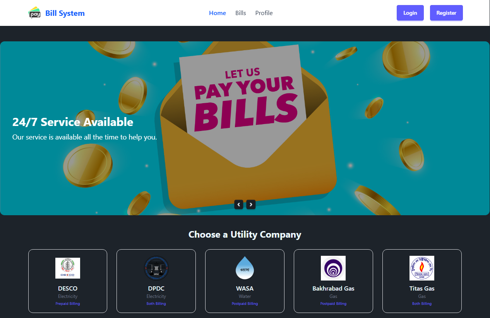
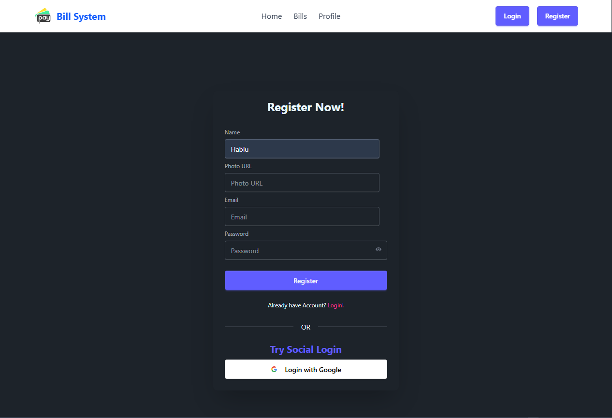
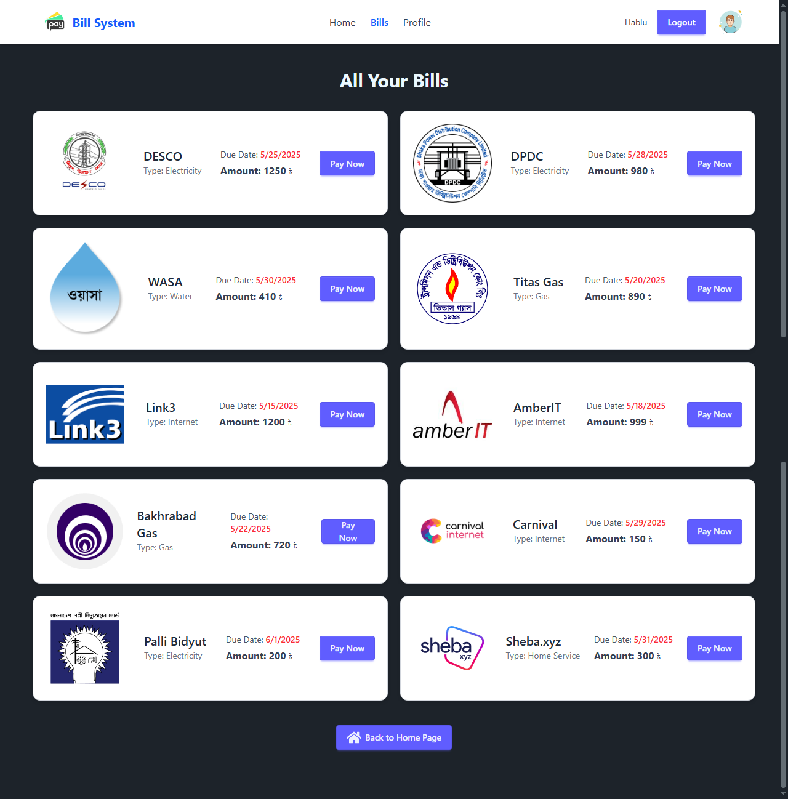
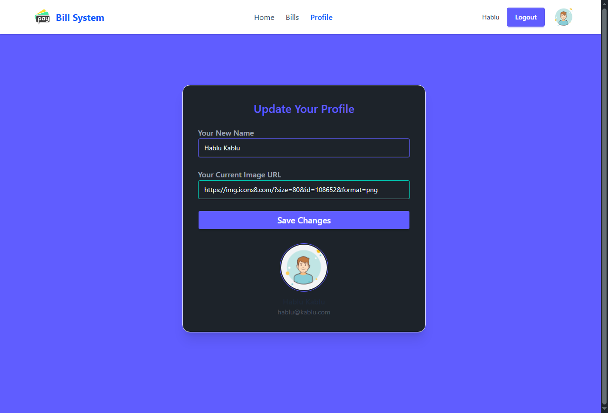

# 💡 Bill Management Website | বিল ম্যানেজমেন্ট ওয়েবসাইট

A modern and simple utility bill payment platform where users can log in to view and pay their electricity, water, gas, and other utility bills.

একটি সুন্দর ও সহজ ইউটিলিটি বিল পেমেন্ট ওয়েবসাইট, যেখানে ইউজাররা লগইন করে বিদ্যুৎ, পানি, গ্যাস ইত্যাদি বিল দেখতে ও পেমেন্ট করতে পারে।

---

## 🌐 Live Website

🔗 [Click Here to Visit](https://bill-management-system-1b076.web.app/)

---

## 🎯 Project Purpose | প্রজেক্ট উদ্দেশ্য

To build a user-friendly platform where users can log in, manage their bills, make payments, and update profile/card information.

একটি ইউজার-ফ্রেন্ডলি প্ল্যাটফর্ম তৈরি করা যেখানে ইউজাররা বিল দেখতে, পরিশোধ করতে ও নিজের প্রোফাইল/কার্ড পরিচালনা করতে পারবে।

---

## 🚀 Key Features | প্রধান ফিচারসমূহ

### 🔐 Authentication
- Email & Password Login/Register
- Google Login (Social Auth)
- Forget Password (No email verification)
- Firebase Authentication (.env based)

### 📄 Pages & Routing
- Home Page (Slider + Utility Cards)
- Login & Register
- Bills Page (Loaded from JSON)
- Bill Details Page (Pay Now + Balance Deduction)
- My Profile Page (Update name, photo, email)

### 🧾 Bills System
- Bill data loaded from JSON file
- Balance deducted after bill payment
- Protected Routes (Unauthorized access blocked)

### 💳 Cards System
- Displays user's cards in a clean layout

### 🎨 UI/UX
- Responsive design with TailwindCSS + DaisyUI
- Smart slider with SwiperJS
- Toastify notifications for feedback

---

## 📄 Pages Description with Screenshots

### 🏠 Home Page | হোম পেজ  
প্রথম পেজ যেখানে একটি স্লাইডার এবং ইউটিলিটি কার্ড দেখানো হয়। ইউজার এখান থেকে বিল পেজ ও অন্যান্য পেজে যেতে পারে।



---

### 🔐 Login & Register Pages | লগইন ও রেজিস্টার পেজ  
নতুন ইউজার রেজিস্টার করতে বা বিদ্যমান ইউজার লগইন করতে পারে।



---

### 🧾 Bills Page | বিল পেজ  
এই পেজে ইউজাররা তাদের বিদ্যুৎ, পানি, গ্যাস ইত্যাদি বিলগুলো দেখতে পারে, যা JSON থেকে লোড হয়।



---

### 💳 Bill Details Page | বিল বিস্তারিত পেজ  
নির্দিষ্ট একটি বিলের পেমেন্ট ডিটেইলস দেখানো হয়। এখানে “Pay Now” বাটনে ক্লিক করলে ব্যালেন্স থেকে বিলের টাকা কেটে নেয়া হয়।

*(তোমার কাছে যদি Bill Details পেজের স্ক্রিনশট থাকে, তাহলে এখানে যুক্ত করো)*

---

### 👤 My Profile Page | প্রোফাইল পেজ  
ইউজার এখানে তার নাম, প্রোফাইল ছবি এবং ইমেইল আপডেট করতে পারে।



---

## 🛠️ Used Technologies & Packages | ব্যবহৃত টুলস ও প্যাকেজসমূহ

| Package                | Description                     |
|------------------------|---------------------------------|
| `react`               | Frontend Framework              |
| `react-router`        | Routing System                  |
| `firebase`            | Authentication + Hosting        |
| `react-toastify`      | Toast Notification              |
| `swiper`              | Image Slider                    |
| `react-icons`         | Icon Library                    |
| `lucide`              | Clean SVG Icons                 |
| `@headlessui/react`   | Accessible UI Elements          |
| `tailwindcss`         | Utility-First CSS               |
| `daisyui`             | Tailwind CSS Component Library  |
| `@vitejs/plugin-react`| React Plugin for Vite           |
| `vite`                | Build Tool                      |

---

## 🧪 Bonus Features | অতিরিক্ত সুবিধাসমূহ

- 🔒 Protected Route (Unauthorized users blocked)
- 💰 Real-time balance deduction after bill payment
- 📸 Profile update with image URL
- ☁️ Firebase Hosting (Live deployment)

---


## 🧭 Run Locally (Optional)

```bash
git clone https://github.com/JahidGittu/Bill-ManageMent-System.git
cd Bill-ManageMent-System
npm install
npm run dev

```bash
👨‍💻 Developer Info | ডেভেলপার তথ্য
Developed by: Jahid Hossen
GitHub: https://github.com/JahidGittu
Email: jahid.hossen.me@gmail.com
